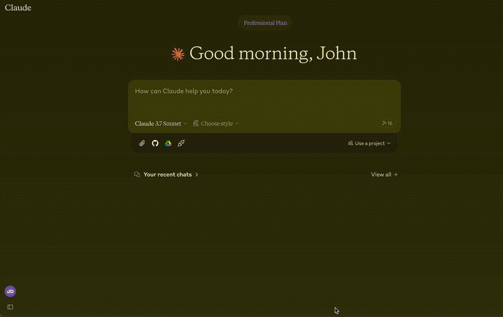
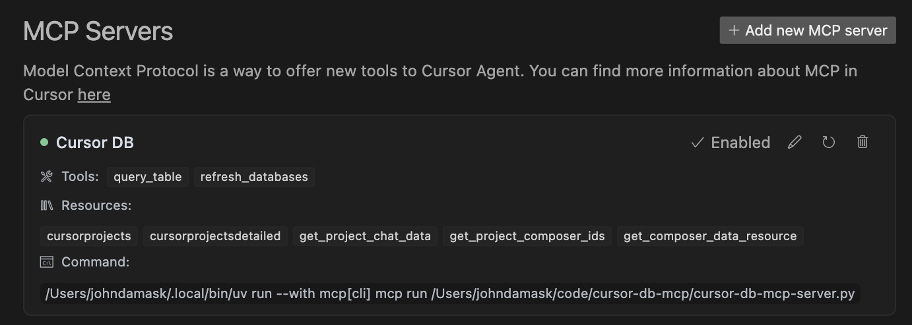

# Cursor DB MCP Server

A Model Context Protocol (MCP) server for accessing Cursor IDE's SQLite databases. This server allows AI assistants to explore and interact with Cursor's project data, chat history, and composer information.



## Features

- List all Cursor projects
- Access AI chat history from projects
- Retrieve composer data
- Query specific tables in Cursor's SQLite databases
- Add custom project directories
- Lifespan context management for efficient resource handling

## Installation

### Easy Installation

Use the provided installation script to install all dependencies:

```bash
python install.py
```

This script will install:
- Basic MCP server dependencies
- MCP CLI tools for testing and inspection

### Manual Installation

1. Clone this repository:
```bash
git clone https://github.com/yourusername/cursor-db-mcp.git
cd cursor-db-mcp
```

2. Install basic dependencies:
```bash
pip install -r requirements.txt
```

3. Install MCP CLI tools (optional, for testing):
```bash
pip install 'mcp[cli]'  # Note the quotes around mcp[cli]
```

If the above command fails, you can install the CLI dependencies directly:
```bash
pip install typer rich
```

## Usage

### Running the Server

```bash
python cursor-db-mcp-server.py
```

Optional arguments:
- `--cursor-path`: Path to Cursor User directory (e.g. ~/Library/Application Support/Cursor/User/)
- `--project-dirs`: List of additional Cursor project directories to scan

Example:
```bash
python cursor-db-mcp-server.py --cursor-path ~/Library/Application\ Support/Cursor/User/ --project-dirs ~/code/project1 ~/code/project2
```

### Testing the Server

You can run the included test script to verify that the MCP server is working correctly:

```bash
python test_mcp_server.py
```

This script will:
1. Start the MCP server
2. Check if MCP CLI tools are available
3. If available, test listing resources, tools, and prompts
4. If not available, perform basic server tests
5. Shut down the server

### Using with Claude Desktop

1. Install the MCP server in Claude Desktop:
```bash
mcp install cursor-db-mcp-server.py
```

2. In Claude Desktop, you can now access your Cursor data by asking questions like:
   - "Show me a list of my Cursor projects"
   - "What's in my chat history for project X?"
   - "Find composer data for composer ID Y"

   See detailed examples below

Note: If Claude shows an error connecting to this MCP it's likely because it can't find uv. To fix this, change the command value to include the fully qualified path to uv. For example:
```
    "Cursor DB Manager": {
      "command": "/Users/johndamask/.local/bin/uv",
      "args": [
        "run",
        "--with",
        "mcp[cli]",
        "mcp",
        "run",
        "/Users/johndamask/code/cursor-db-mcp/cursor-db-mcp-server.py"
      ]
    }
```

### Using with Cursor IDE

1. Open Cursor and navigate to Settings->Cursor Settings->MCP. 
2. Click: Add new MCP server
3. Name: Cursor DB MCP; Type: Command
4. Command: \<fully qualified path to\>uv run --with mcp[cli] mcp run \<fully qualified path to\>/cursor-db-mcp-server.py 



Now you can ask questions about the database or retrieve info about historical chats.


## Available Resources

- `cursor://projects` - List all available Cursor projects
- `cursor://projects/detailed` - List projects with detailed information
- `cursor://projects/{project_name}/chat` - Get chat data for a specific project
- `cursor://projects/{project_name}/composers` - Get composer IDs for a specific project
- `cursor://composers/{composer_id}` - Get data for a specific composer

## Available Tools

- `query_table` - Query a specific table in a project's database
- `refresh_databases` - Refresh the list of database paths

## Available Prompts

- `explore_cursor_projects` - Create a prompt to explore Cursor projects
- `analyze_chat_data` - Create a prompt to analyze chat data from a specific project

# Example Usage with Claude

## Listing Projects

**User**: "Can you show me a list of my Cursor projects?"

**Claude**: 
```
I'll retrieve a list of your Cursor projects.

Here are the Cursor projects I found:
- project1 (path: /Users/username/Library/Application Support/Cursor/User/workspaceStorage/abc123/state.vscdb)
- project2 (path: /Users/username/Library/Application Support/Cursor/User/workspaceStorage/def456/state.vscdb)
- custom-project (path: /Users/username/code/custom-project/state.vscdb)
```

## Viewing Chat History

**User**: "Show me the chat history from my 'project1' project."

**Claude**:
```
I'll retrieve the chat history from your 'project1' project.

Here's the chat history I found:

Chat: "Understanding React Hooks"
- You: "Can you explain how useEffect works in React?"
- Claude: "The useEffect hook in React is used for handling side effects in functional components..."

Chat: "Debugging API Connection"
- You: "I'm getting a 401 error when connecting to the API. Here's my code..."
- Claude: "It looks like you're missing the authorization header in your request..."
```

## Querying Database Tables

**User**: "Can you search for keys related to 'settings' in the ItemTable of my 'project1' project?"

**Claude**:
```
I'll search for keys related to 'settings' in the ItemTable of your 'project1' project.

Here are the results:
1. Key: "workbench.settings.editor"
   Value: {"mode": "ui", "lastFocusedSettingId": "editor.fontSize"}

2. Key: "settings.language"
   Value: "en"

3. Key: "settings.theme"
   Value: "dark"
```

## Analyzing Chat Data

**User**: "Can you analyze the chat data from my 'project1' project and tell me what topics I've been discussing most frequently?"

**Claude**:
```
I'll analyze the chat data from your 'project1' project.

Based on your chat history, here are the most frequent topics you've been discussing:
1. React Hooks and Components (5 conversations)
2. API Integration (3 conversations)
3. CSS Styling (2 conversations)
4. Performance Optimization (2 conversations)
5. Debugging (1 conversation)

The most common questions were about state management in React and handling API responses.
``` 

# Architecture

The server uses the Model Context Protocol (MCP) to expose Cursor's SQLite databases to AI assistants. Key components include:

1. **Lifespan Context Management**: The server uses MCP's lifespan API to efficiently manage resources throughout the server's lifecycle.

2. **CursorDBManager**: Handles the detection and management of Cursor projects and their databases.

3. **Resources**: Expose data from Cursor databases as MCP resources.

4. **Tools**: Provide functionality to query databases and manage projects.

5. **Prompts**: Define reusable templates for AI interactions.

# How It Works

The server scans your Cursor installation directory to find project databases (state.vscdb files). It then exposes these databases through MCP resources and tools, allowing AI assistants to query and analyze the data.

# License

MIT 